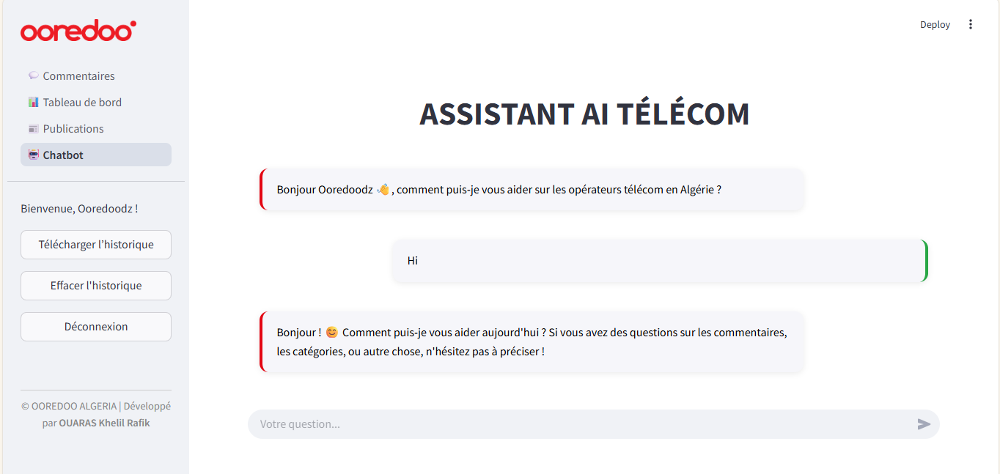

# 📊 Dashboard Ooredoo

Ce projet vise à développer un tableau de bord interactif pour visualiser et analyser les données relatives aux performances d'Ooredoo sur le marché algérien. Il permet aux utilisateurs d'explorer diverses métriques clés, telles que le nombre d'abonnés, la qualité du service, et les comparaisons avec les concurrents.

## 🧰 Fonctionnalités

* Visualisation interactive des données (graphiques, cartes, tableaux)
* Comparaison des performances d'Ooredoo avec celles de Djezzy et Mobilis
* Analyse des tendances temporelles
* Filtrage dynamique des données par région, période, et type de service
* Interface utilisateur intuitive et responsive

## 🏗️ Architecture du Projet

Le projet est structuré comme suit :

```plaintext
Dashboard-Ooredoo/
├── assets/                 # Fichiers multimédias (images, logos)
├── data/                   # Jeux de données pour l'analyse
├── pages/                  # Pages du tableau de bord
├── .streamlit/             # Configurations Streamlit
├── .chromadb/              # Données de la base ChromaDB
├── Authentification.py     # Module d'authentification
├── requirements.txt        # Dépendances Python
└── README.md               # Documentation du projet
```

## 🚀 Installation et Exécution

1. **Cloner le dépôt :**

   ```bash
   git clone https://github.com/OUARAS-khelil-Rafik/Dashboard-Ooredoo.git
   cd Dashboard-Ooredoo
   ```

2. **Créer un environnement virtuel (optionnel mais recommandé) :**

   ```bash
   python -m venv env
   source env/bin/activate  # Sur Windows : env\Scripts\activate
   ```

3. **Installer les dépendances :**

   ```bash
   pip install -r requirements.txt
   ```

4. **Lancer l'application :**

   ```bash
   streamlit run 🔒Authentification.py
   ```

## 📸 Aperçu Visuel



## 📚 Ressources Supplémentaires

* [Streamlit Documentation](https://docs.streamlit.io/)
* [Pandas Documentation](https://pandas.pydata.org/docs/)
* [Matplotlib Documentation](https://matplotlib.org/stable/contents.html)

## 🤝 Contributeurs

* **OUARAS Khelil Rafik** - [GitHub](https://github.com/OUARAS-khelil-Rafik)

## 📄 Licence

Ce projet est sous licence MIT - voir le fichier [LICENSE](LICENSE) pour plus de détails.
